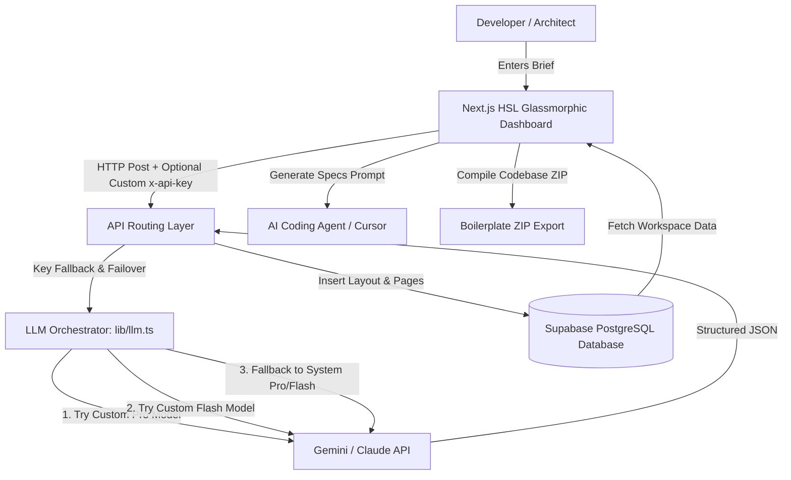

# 🚀 Frontend Planner (AI-Powered Architecture Orchestrator)

[](https://nextjs.org/)
[](https://www.typescriptlang.org/)
[](https://supabase.com/)
[](https://tailwindcss.com/)
[](https://sdk.vercel.ai/)

**🔗 Live Demo:** [https://frontend-planner-one.vercel.app/](https://frontend-planner-one.vercel.app/)

An interactive, premium-designed frontend architecture orchestrator. **Frontend Planner** decomposes high-level, vague product briefs into structured, page-level route trees, atomic components, hooks, contexts, and dependencies, ready to export as clean codebases or optimized coding prompts for AI agents (Cursor, Claude Code, GitHub Copilot).

---

## ✨ Features

- **🎯 Brief Decomposition:** Turns a raw product description into a logical Next.js App Router or React SPA page structure.
- **⚛️ Lazy Atomic Drilling:** Recursively breaks down page route nodes into:
  - **Components:** Classified as Atoms, Molecules, or Organisms with complete TypeScript props specifications.
  - **Hooks:** React custom hooks with inputs/outputs type signatures.
  - **Contexts:** Global/local state managers with interface value shapes.
  - **Data Shapes & Mock Data:** TS schemas and conformant JSON structures.
  - **Assets & Third-Party Libs:** Required icons, illustrations, and npm packages.
- **🔄 Smart LLM Orchestration & Failover:**
  - Dynamic dual provider support (Google Gemini & Anthropic Claude).
  - Tries custom API keys with pro models, falls back to flash models on errors, and automatically offers to use the default system key.
- **💡 Quota Fallback Modal:** If a custom API key hits a Google/Anthropic rate limit or quota block (429/quota error), a beautiful modal asks the user if they want to fallback to the system's default key.
- **💰 Real-Time Cost Indicators:** Track estimated token-based monetary cost per generation. Free system fallback calls are calculated as `$0` cost to keep usage reports accurate.
- **🛡️ Coherence & Dependency Validation:** Analyzes parent-child component mappings, validation warnings, and highlights circular dependencies.
- **📦 Multi-Format Exports:** Download the entire planned directory structure as a clean boilerplate folder ZIP, a complete Markdown specification report, or raw JSON schema.

---

## 🏗️ System Architecture



---

## 📊 Database Schema

The database relies on strict Row Level Security (RLS) policies to isolate plans and components per authenticated user:

1. **`profiles`**: Synchronizes logged-in users from Supabase Auth.
2. **`plans`**: Contains the main plan meta descriptions, framework configurations, and cumulative API cost indicators.
3. **`plan_nodes`**: Stores page routes and their lazy-decomposed children (components, hooks, shapes, etc.) with metadata parameters.
4. **`plan_node_dependencies`**: Tracks relationships (e.g., `uses_context`, `uses_hook`, `uses_component`) to prevent circular dependencies.

---

## 🛠️ Getting Started

### Prerequisites

- Node.js (v18+)
- Supabase Account / Local CLI Instance
- Google AI Studio API Key or Anthropic Console Key

### Installation

1. Clone the repository:
   ```bash
   git clone https://github.com/ZainDhariwal/Frontend-Planner.git
   cd Frontend-Planner
   ```

2. Install dependencies:
   ```bash
   npm install
   ```

3. Configure environment variables (`.env.local`):
   ```env
   NEXT_PUBLIC_SUPABASE_URL=your_supabase_project_url
   NEXT_PUBLIC_SUPABASE_ANON_KEY=your_supabase_anon_key
   GEMINI_API_KEY=your_fallback_gemini_key
   ANTHROPIC_API_KEY=your_fallback_anthropic_key
   ```

4. Apply Supabase Migrations:
   Run the SQL file inside `supabase/migrations/20260610000000_init.sql` on your Supabase SQL Editor.

5. Run development server:
   ```bash
   npm run dev
   ```

---

## 🚀 Usage Flow

1. **Sign In:** Authenticate using Google Auth or a demo user account.
2. **Setup API Key (Optional):** Click on the settings icon on the Navbar to store your own Gemini or Claude API key locally in the browser's `localStorage` (keys are never saved on the server).
3. **Create a Plan:** Provide a title, choose a framework (Next.js/React), and enter a product brief.
4. **Decompose Route Pages:** Click **Decompose** on any generated page route node to generate its internal atomic structure.
5. **Regenerate / Modify:** Click **Redo** to re-decompose a node with custom specifications, or edit details directly inside the inspector sidebar.
6. **Code Scaffolding:** Copy prompt specifications directly to feed into Cursor, or export a ZIP of files.
